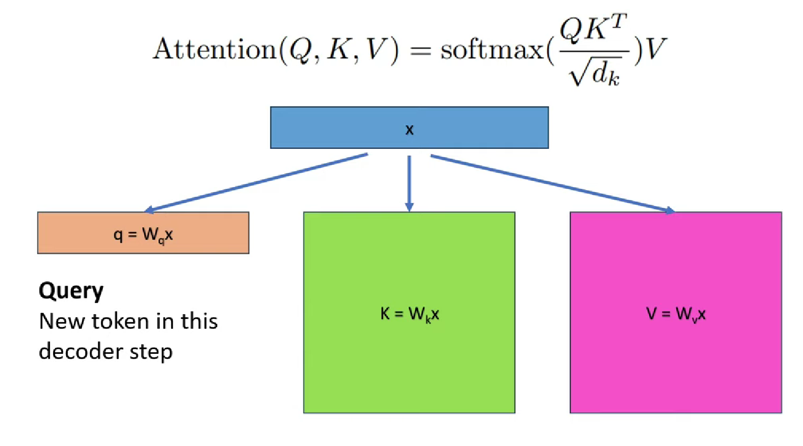

# Caching in vLLM

VLLM supports does two types of caching to make token generation faster. 

## 1. KV Caching

Autogressive models process all the tokens to predict next token, then for next token, again all previous tokens are used.
If we do not cache KV matrixs, the forward pass will take so much time to predict new token each time. Also as context grows, it will scale time with `O(n**2)`. 

So in KV caching, VLLM stores KV metrics for all tokens available at the point, so as next token is predicted, we just add sinlge column and row in KV matrix.

Why do we just store KV and not Q also?

Q matrix is single row to predict next token and not huge metrix.

## 2. Prefix Caching

Every time an LLM receives a prompt, it must perform a "prefill" phase. It converts the input text into Key-Value (KV) tensors. If you have a 2,000-token system prompt, the model recalculates those 2,000 tokens every single time a user sends a message. This is slow and wastes GPU power.With Caching, vLLM stores those tensors in memory. If the next message starts with the same 2,000 tokens, it skips the math and just loads them from the "cache." VLLM uses Radix tree to store blocks of caches.

### How it Works

#### A. Hashing for Identification

How does vLLM know if it has "seen" a block of text before? It uses Hashing.
For every block of tokens, it calculates a unique ID (a hash) based on:

1. The tokens in that specific block.
2. The hash of the previous block.
  This ensures that "Hello" at the start of a prompt has a different hash than "Hello" appearing 500 tokens deep.

The tokens in that specific block.

The hash of the previous block.
This ensures that "Hello" at the start of a prompt has a different hash than "Hello" appearing 500 tokens deep.

#### B. Eviction Policy (LRU)

GPU memory is expensive and limited. When the cache is full, vLLM uses a Least Recently Used (LRU) policy. It looks for the branch of the tree that hasn't been used in a long time and "prunes" it (deletes it from memory) to make room for new prompts.

#### C. Reference Counting

Because multiple users might be using the same system prompt at the same time, vLLM uses Reference Counting. A block of memory is only deleted if its "reference count" is zero—meaning no active requests are currently reading from it.

### Example

Let’s walk through an example using a Customer Support Bot that uses a long system prompt.

**The Scenario**

- System Prompt (SP): "You are a helpful support agent for 'CloudScale Inc.' Our refund policy is 30 days. Our support hours are 9-5..." (Assume this is 100 tokens long).
- Block Size: In vLLM, memory is managed in small chunks (blocks). Let’s say 1 block = 16 tokens.
- User A asks: "How do I get a refund?"
- User B (minutes later) asks: "What are your hours?"

##### Step 1: User A sends their request

Prompt: [System Prompt] How do I get a refund?

1. Logical Breaking: vLLM breaks the text into blocks. The System Prompt covers roughly 6.25 blocks.
2. Hashing: vLLM calculates a unique ID (hash) for each block.
  - Block 1 hash = Hash("You are a helpf")
    - Block 2 hash = Hash(Block 1 Hash + "ul support agen") — Note how the hash depends on the previous block.
3. The Cache Miss: vLLM looks in its Radix Tree (its memory map). It’s empty.
4. Computation: The GPU does the heavy lifting (the "Prefill"). It calculates the KV tensors for the System Prompt + User A’s question.
5. Storage: These tensors are saved in GPU memory. In the Radix Tree, a path is created:
  - Root -> [SP Block 1] -> [SP Block 2] ... -> [User A Question]

##### Step 2: User B sends their request

Prompt: [System Prompt] What are your hours?

1. Matching: vLLM hashes the first block of User B’s prompt.
2. The Cache Hit: It checks the Radix Tree and finds [SP Block 1] already exists! It continues checking and finds that the entire System Prompt (all 6+ blocks) is already in memory.
3. The Shortcut: Instead of recalculating the System Prompt, vLLM simply "points" to the existing memory blocks.
4. Partial Computation: The GPU only has to calculate the KV tensors for the new part: "What are your hours?".
5. Result: User B gets their answer almost instantly because 90% of the work was skipped.

**The "Reference Count"**
While User A and User B are getting their answers, vLLM marks those System Prompt blocks as "In Use" (Ref Count = 2). This prevents the system from accidentally deleting them while the GPU is still reading them.

**The "Eviction" (Cleaning Up)**
Suppose the GPU memory gets 100% full.

1. User A and User B finish their chats. The "Ref Count" for those blocks drops to 0.
2. The blocks stay in memory just in case a User C comes along.
3. If a new user arrives with a different huge document and there’s no room, vLLM looks for the "Least Recently Used" (LRU) blocks—perhaps User A's specific question from an hour ago—and deletes them to make space.

### Practicle Guide

#### 1. Prompts

If you put a dynamic variable (like a "Current Date" or "User Name") at the beginning of your prompt, you break the cache for everything that follows. 

Always put your static content (long instructions, document context) at the top of the prompt. Put the moving parts (timestamps, specific user queries) at the very bottom.

#### 2. Memory Fragmentation

vLLM allocates memory in "blocks." If your blocks are too big and your prompts are short, you waste expensive GPU RAM (internal fragmentation). If they are too small, the overhead of managing them slows down the system.

If you are serving thousands of small, unique requests (like a chat app), you want to ensure your `block_size` is optimized. If you are serving a few users with massive documents, you need to monitor Cache Hit Rate. If the hit rate is low, you might need a GPU with more VRAM to keep the "Radix Tree" from constantly deleting old data.